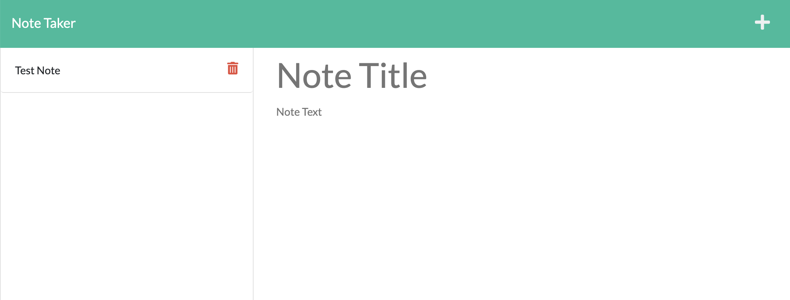
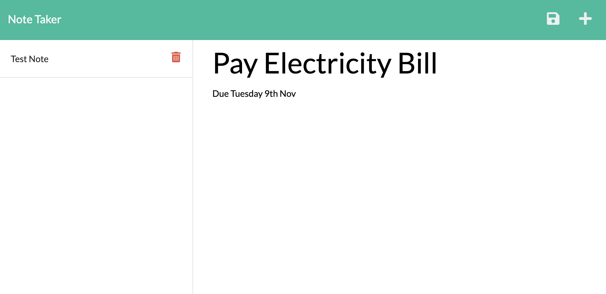

# 11 Express.js: Note Taker


## Table of Contents
- [Description](#description)
- [User-Story](#user-story)
- [Mock-up](#mock-up)
- [Installation](#installation)
- [Usage](#usage)
- [License](#license)

## Description

An application called Note Taker that can be used to write and save notes. This application will use an Express.js back end and will save and retrieve note data from a JSON file.

## User-Story

```
AS A small business owner
I WANT to be able to write and save notes
SO THAT I can organize my thoughts and keep track of tasks I need to complete
```

## Mock-Up

The following images show the web application's appearance and functionality:






# Installation
1. Launch [LexMastro GitHub](https://github.com/LexMastro) & select 'note-take' repository

2. Clone the repository 
```bash
git clone git@github.com:LexMastro/note-taker/.git
```
2. Launch with `node.js` in web browser to use note taker.

## Usage
npm install
npm express
Heroku
Node.js

## License
This project is licensed under MIT.
